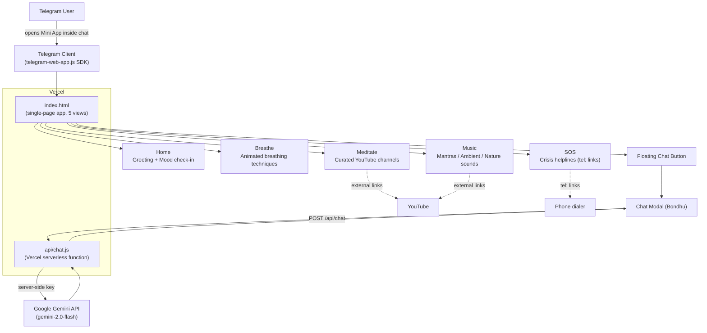

# Bondhu — Your Wellness Friend 💚

A Telegram Mini App that offers guided breathing exercises, meditation and music resources, mood tracking, an AI chat companion, and crisis helplines — all in one lightweight, single-page app.

## Overview

Bondhu ("বন্ধু", Bengali for "friend") is a wellness companion built to live inside Telegram as a [Mini App](https://core.telegram.org/bots/webapps). Instead of asking someone to install a separate app, it opens instantly inside a Telegram chat and greets the user by their Telegram first name.

The app exists to give people a low-friction, always-available first line of support for everyday stress and anxiety: a breathing coach, a curated library of meditation/music channels, a simple mood check-in, an empathetic AI chat, and — critically — one-tap access to real crisis helplines (KIRAN, Vandrevala Foundation, iCall, AASRA) for anyone in India who needs more than an app can offer.

A companion repository, [`bondhu-privacy`](https://github.com/srksourabh/bondhu-privacy), hosts the privacy policy for this same product (deployed at `bondhu-privacy.vercel.app`), which Telegram requires bots/Mini Apps to link to.

## Key Features

- **Mood check-in** — one-tap mood selector (Great / Good / Okay / Low / Hard) on the home screen, with supportive responses and an automatic redirect to crisis resources if the user selects "Hard".
- **Guided breathing** — an animated breathing circle that walks the user through 4 techniques: 4-7-8 Relaxing Breath, Box Breathing, Anulom Vilom, and Belly Breathing, each with its own timed inhale/hold/exhale pattern.
- **Meditation library** — curated links to beginner-friendly, sleep, and spiritual meditation YouTube channels, plus one-tap YouTube search shortcuts for common meditation queries.
- **Music & sounds** — curated links and search shortcuts for mantras/chants, ambient/instrumental music, and nature sounds (rain, ocean, forest, etc.).
- **AI chat companion ("Bondhu")** — a floating chat button opens a modal chat backed by Google's Gemini API (via a server-side proxy so the API key is never exposed to the browser). The system prompt keeps replies short, warm, multilingual (Hindi/Bengali/English), and instructs the model to surface the KIRAN helpline if self-harm is mentioned.
- **SOS crisis support** — a dedicated page listing 24/7 Indian mental health helplines with tap-to-call buttons (`tel:` links).
- **Telegram-native integration** — reads the Telegram WebApp SDK to personalize the greeting with the user's first name and to expand the Mini App to full height.

## Tech Stack

| Layer | Technology |
|---|---|
| Frontend | Single static `index.html` — vanilla HTML/CSS/JavaScript (no framework, no build step) |
| Fonts / UI | Google Fonts (Poppins), emoji icons, hand-rolled CSS (custom properties, gradients, animations) |
| Telegram integration | [Telegram Web App JS SDK](https://telegram.org/js/telegram-web-app.js) |
| Backend | 1 serverless function: `api/chat.js` (Node.js, Vercel serverless function runtime) |
| AI | Google Gemini API (`gemini-2.0-flash` model), called server-side to keep the API key secret |
| Hosting/deploy | [Vercel](https://vercel.com) (config in `vercel.json`) — static file hosting + serverless functions |

There is no database, no package.json, and no client-side framework — the entire client is one self-contained HTML file, and the only backend logic is a single request/response proxy to Gemini.

## Architecture



## Setup & Installation

This is a static site plus one serverless function, deployed on Vercel. There is no build step and no `package.json` — nothing to `npm install`.

**Prerequisites:**
- A [Vercel](https://vercel.com) account (free tier is enough)
- A Google Gemini API key ([Google AI Studio](https://aistudio.google.com/app/apikey))
- A Telegram bot registered with [@BotFather](https://t.me/BotFather) if you want to run it as an actual Telegram Mini App (optional for just viewing the static page)

**Steps:**

1. Clone the repo:
   ```bash
   git clone https://github.com/srksourabh/bondhu-miniapp.git
   cd bondhu-miniapp
   ```
2. Install the [Vercel CLI](https://vercel.com/docs/cli) if you don't already have it:
   ```bash
   npm install -g vercel
   ```
3. Set the Gemini API key as an environment variable in your Vercel project (Project Settings → Environment Variables, or via CLI):
   ```bash
   vercel env add GEMINI_API_KEY
   ```
4. Deploy:
   ```bash
   vercel deploy --prod
   ```
   Vercel picks up `vercel.json`, which configures `api/chat.js` as a serverless function (256 MB memory, 30s max duration) and rewrites `/api/*` requests to it. `index.html` is served as-is at the root.
5. (Optional — to run inside Telegram) In [@BotFather](https://t.me/BotFather), create/edit a bot and set its Mini App URL to your Vercel deployment URL (e.g. `https://bondhu-miniapp.vercel.app`). Telegram will require a linked privacy policy URL — this project uses the one hosted in the `bondhu-privacy` repo.

There is no local dev server script in this repo; the simplest way to preview the static UI locally is to open `index.html` directly in a browser (the chat feature won't work without the deployed `/api/chat` endpoint) or run `vercel dev` to emulate the serverless function locally.

## Usage

- Open the deployed URL directly in a browser, or open it as a Mini App from inside a Telegram chat with the linked bot.
- Use the bottom navigation bar to switch between **Home**, **Breathe**, **Meditate**, **Music**, and **SOS**.
- On **Home**, tap a mood emoji for a quick supportive response, or tap the chat banner/floating button to start talking to Bondhu.
- On **Breathe**, pick a technique card, then tap **Start** to follow the animated breathing circle (color and size change with each inhale/hold/exhale phase).
- On **Meditate** and **Music**, tap a channel card to open it on YouTube in a new tab, or tap a suggestion chip to run a pre-filled YouTube search.
- On **SOS**, tap **Call** next to any helpline to open the device's phone dialer with the number pre-filled.
- The floating 💬 button (bottom-right, on every page) opens a chat modal where messages are sent to `/api/chat`, which calls Gemini server-side and returns Bondhu's reply; chat history is kept client-side for context (capped at the last 20 messages) and is not persisted after the page is closed.
